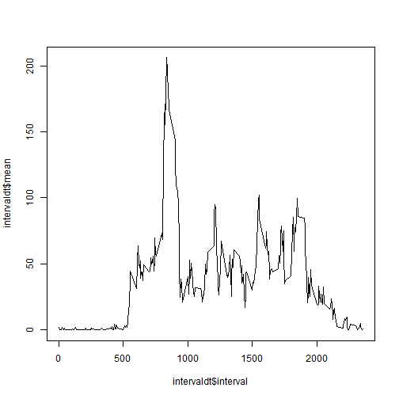

## Loading and preprocessing the data

```r
library(data.table)
library(ggplot2)
datazipname <- "activity.zip"
datacsvname <- "activity.csv"

if (!file.exists(datacsvname)) {
    unzip(zipfile = datazipname, overwrite=TRUE)
}
```


## What is mean total number of steps taken per day?
This is calculated by first determining the total number of steps for each day, then giving the mean

```r
gort <- na.omit(read.csv(datacsvname, header = TRUE, colClasses = c("numeric", "Date", "numeric")))
df <- data.frame(steps=gort$steps, date=gort$date)
dt <- data.table(df)
dt <- dt[,list(mean=mean(steps), sd=sd(steps), tot=sum(steps)), by=date]
mean(dt$tot)
```

```
## [1] 10766.19
```
The mean total number of steps per day is 10766.19

Here is a bar plot of the total number of steps taken by day


Amd here is a histogram of the daily total number of steps (showing frequency)

```r
hist(dt$tot)
```

 

The mean of the total number of steps taken each day is 10,766.19.  The median is 10,765.00

## What is the average daily activity pattern?

```r
df <- data.frame(steps=gort$steps, interval=gort$interval)
intervaldt <- data.table(df)
intervaldt <- intervaldt[,list(mean=mean(steps)), by=interval]
intmax <- intervaldt[intervaldt$mean == max(intervaldt$mean),]
plot(x=intervaldt$interval, y=intervaldt$mean, type="l")
```

 

The maximum number of average steps across all days takes place in time interval 835, which has a value of 206.17


## Imputing missing values
There are quite a number of measurement periods with missing data for the number of steps (coded as `NA`)


## Are there differences in activity patterns between weekdays and weekends?
