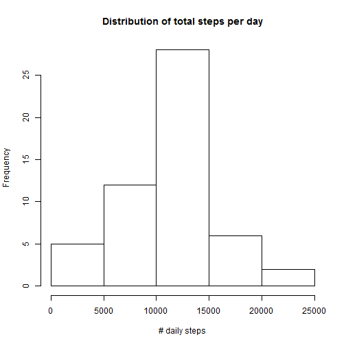
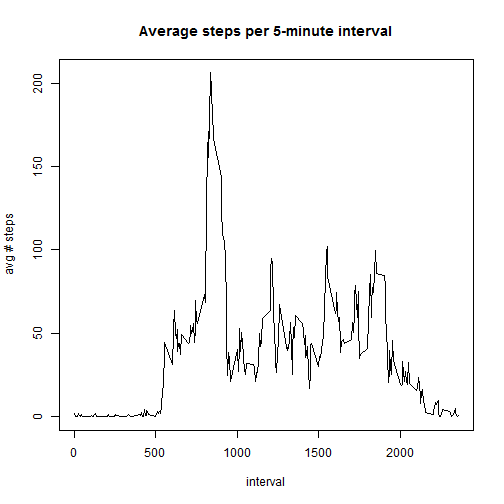
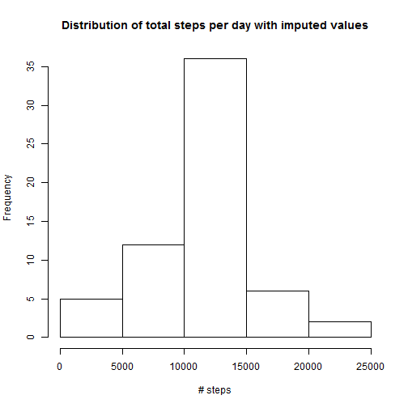

## Overview of the data set

This assignment makes use of data from a personal activity monitoring
device. This device collects data at 5 minute intervals throughout the
day. The data consists of two months of data from one anonymous
individual collected during the months of October and November, 2012
and includes the number of steps taken in 5 minute intervals each day.

Each interval represents a 5-minute time within the day.  For example,
the interval 1730 represents the data collected between 17:30 to
17:35.

There are missing data in the `steps` column, which we deal with in
this project by imputing the missing values based on the average
values for those intervals for all records that have data.

## Loading and preprocessing the data


The data are contained in a CSV file called `activity.csv`.  The first
step in our process is to assure that CSV file is available.  The data
are included in a compressed zip file in this project.


```r
library(data.table)
library(ggplot2)
library(lubridate)
datazipname <- "activity.zip"
datacsvname <- "activity.csv"

if (!file.exists(datacsvname)) {
    unzip(zipfile = datazipname, overwrite=TRUE)
}
```


## What is the mean total number of steps taken per day?
This is calculated by first determining the total number of steps for each day, then giving the mean


```r
activity <- read.csv(datacsvname, header = TRUE, colClasses = c("numeric", "Date", "numeric"))
gort <- na.omit(activity)
df <- data.frame(steps=gort$steps, date=gort$date)
dt <- data.table(df)
dt <- dt[,list(mean=mean(steps), sd=sd(steps), tot=sum(steps)), by=date]
```

Here is a histogram of the daily total number of steps (showing frequency)


```r
hist(dt$tot)
```

 

The mean of the total number of steps taken each day is **10,766.19**

The median is **10,765.00**

## What is the average daily activity pattern?

```r
df <- data.frame(steps=gort$steps, interval=gort$interval)
intervaldt <- data.table(df)
intervaldt <- intervaldt[,list(mean=mean(steps)), by=interval]
intmax <- intervaldt[intervaldt$mean == max(intervaldt$mean),]
plot(x=intervaldt$interval, y=intervaldt$mean, type="l")
```

 

The maximum number of average steps across all days takes place in
time interval **835**, which has a value of
**206.17**


## Imputing missing values

There are quite a number of measurement periods with missing data for
the number of steps (coded as `NA`).  Because this missing data could
skew or bias calculations, we will try to impute the missing values.

The method used here is a simple average of time intervals.  We will
replace each missing value with the average number of steps for that
interval


```r
## First, add timestamp to convert date and interval into POSIXct
activity$timestamp <- as.POSIXct(paste(activity$date, formatC(activity$interval/100, decimal.mark=":", digits=2, format="f")), tz="GMT")
df <- data.frame(steps=activity$steps, interval=activity$interval)
activitydt <- data.table(activity)
## calculate mean for time intervals that have no missing data
intervaldt <- data.table(df)
intervaldt <- intervaldt[,list(mean=mean(steps, na.rm=TRUE)), by=interval]
intmax <- intervaldt[intervaldt$mean == max(intervaldt$mean),]
## now merge the average values with the missing interval values
imputed <- merge(x=activitydt, y=intervaldt, by="interval")
## replace all missing values with the mean number of steps for that interval
for (i in 1:nrow(imputed)) imputed[i]$steps <- ifelse(is.na(imputed[i]$steps), imputed[i]$mean, imputed[i]$steps)
```

Here is a histogram of the daily total number of steps with imputed missing values


```r
dailyall <- imputed[,list(tot=sum(steps)), by=date]
hist(dailyall$tot)
```

 

```r
meanall <- mean(dailyall$tot)
medianall <- median(dailyall$tot)
```

The mean of the total number of steps taken each day is **10,766.19**

The median is **10,766.19**

With the imputed values added in, the median and mean now match.

## Are there differences in activity patterns between weekdays and weekends?
Let's look at possible differences in activity patterns between weekdays and weekends


```r
imputed$weekday <- ifelse( wday(imputed$timestamp, label=FALSE) %in% c(1,7), "weekend", "weekday")
intervaldt <- imputed[imputed$weekday=="weekend",list(mean=mean(steps)), by=interval]
par(mfrow=c(2,1))
intervaldt <- imputed[imputed$weekday=="weekday",list(mean=mean(steps)), by=interval]
plot(x=intervaldt$interval,
     y=intervaldt$mean,
     type="l",
     main="Weekday",
     xlab="interval", ylab="# steps")
intervaldt <- imputed[imputed$weekday=="weekend",list(mean=mean(steps)), by=interval]
plot(x=intervaldt$interval,
     y=intervaldt$mean,
     type="l",
     main="Weekend",
     xlab="interval", ylab="# steps")
```

 


